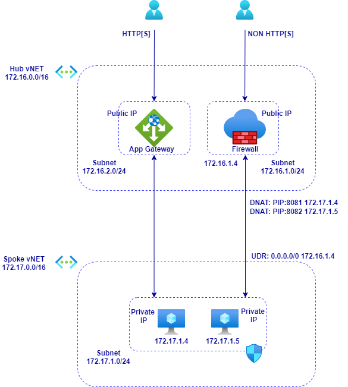

# **Azure Firewall and Application Gateway in Parallel in Hub <> Spoke**

# Contents
[Overview](#overview)

[Deployment](#deployment)

# Overview

This Terraform module deploys Hub and Spoke vNETs connected with vNET Peering. An Azure Application Gateway and Azure Firewall sit in parallel in the Hub vNET. Implement this design if there is
a mix of web and non-web workloads in the virtual network. Azure WAF protects inbound traffic to the web workloads, and the Azure Firewall inspects inbound traffic for the other applications. The Azure Firewall will protect outbound flows from both workload types.

Some useful documentation:

Azure Virtual Network Security Options [documentation](https://docs.microsoft.com/en-us/azure/architecture/example-scenario/gateway/firewall-application-gateway#firewall-and-application-gateway-in-parallel)

Once deployed it should look like this:

Note that this stores state locally so a backend block with need to be added if required.

# Deployment

Steps:
- Log in to Azure Cloud Shell at https://shell.azure.com/ and select Bash
- Ensure Azure CLI and extensions are up to date:
  
  `az upgrade --yes`
  
- If necessary select your target subscription:
  
  `az account set --subscription <Name or ID of subscription>`
  
- Clone the  GitHub repository:
  
  `git clone https://github.com/mattweale/azure-hub-spoke-app-gateway`
  
  - Change directory:
  
  `cd ./azure-hub-spoke-app-gateway`
  - Initialize terraform and download the azurerm resource provider:

  `terraform init`

- Now start the deployment (when prompted, confirm with **yes** to start the deployment):
 
  `terraform apply`

Deployment takes approximately 20 minutes. 
## Explore and verify

After the Terraform deployment concludes successfully, the following has been deployed into your subscription:
- A resource group named **tf-app-gw-lab-rg** containing:
  - One Hub vNET containing a Firewall and an Application Gateway [with WAF].
  - One Spoke vNET containing two Virtual Machine with Windows 2019 Datacenter Edition running IIS.

Verify these resources are present in the portal.

Credentials are identical for both VMs:
- User name: AdminUser
- Password: Pa%%w0rd123!

You may log on to each VM directly via RDP using a Firewall DNAT Rule via the Public IP Address of the Firewall, 8081 for VM1 and 8082 for VM2; remember to add your RDP Client Source IP to variables.tf. Alternatively you could deploy and connect through Bastion. Disable IE Enhanced Security Configuration in Server Manager, open Internet Explorer and access http://localhost. You will see  a blank page with the VM name in the upper left corner.

From a browser, connect to the Public IP Address of the Application Gateway and refresh to cycle between "spoke-vm-1" and "spoke-vm-2".

## Delete all resources

Delete the tf-app-gw-lab-rg resource groups. This may take up to 20 minutes to complete. Check back to verify that all resources have indeed been deleted.

In Cloud Shell, delete the azure-hub-spoke-app-gateway directory:

`rm -rf azure-hub-spoke-app-gateway`